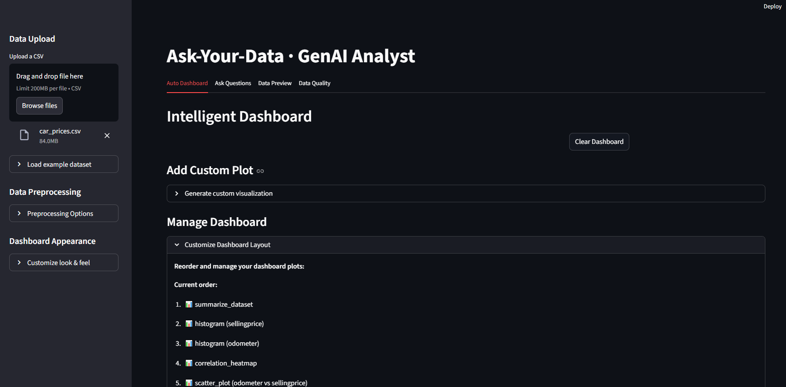
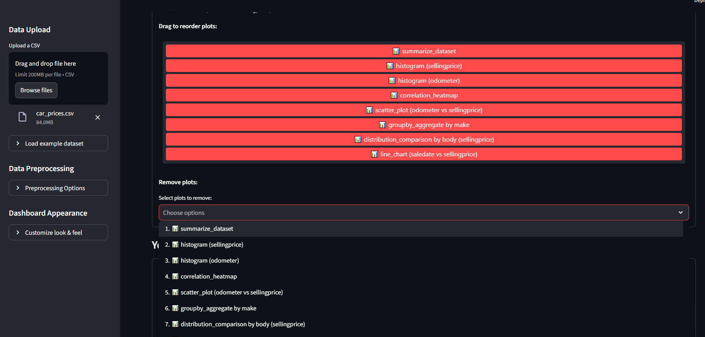
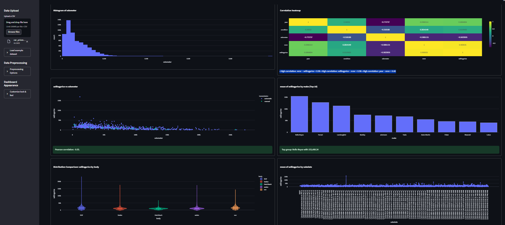
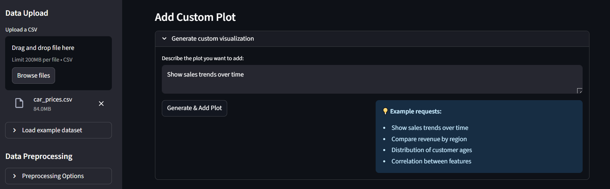
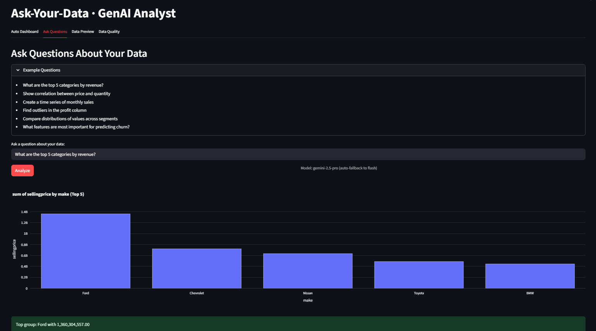
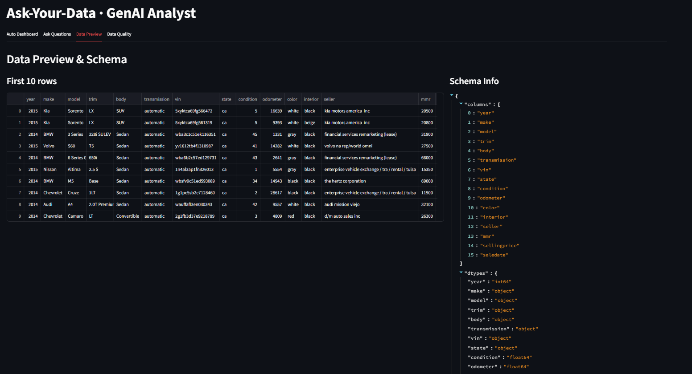
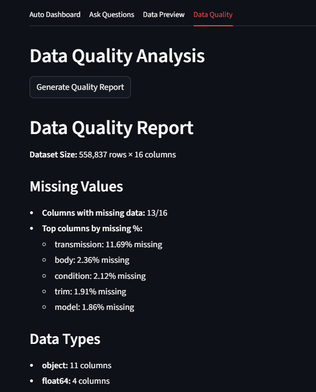

# 📊 Ask-Your-Data: AI-Powered Data Analysis Platform — *GenAI Analyst*

## Description
Developed a sophisticated **AI-powered data analysis platform** that transforms how users interact with their data through natural language processing and automated visualization generation.  
The system leverages Google's Gemini AI models to interpret user questions, automatically select appropriate analysis methods, and generate publication-ready visualizations, making advanced analytics accessible to non-technical users.

## Key Features
- Natural language data queries with **Gemini 2.5 Pro/Flash** models  
- **15+ automated analysis functions** covering statistics, ML, and visualization  
- Intelligent dashboard generation with **4–8 smart visualizations**  
- Real-time data preprocessing and quality assessment  
- **LangChain integration** for structured tool calling and prompt management  
- Drag-and-drop dashboard customization with interactive plot management  

## Performance Highlights
- **Auto Dashboard Generation:** comprehensive dashboards in **~5–10s**  
- **Query Processing:** natural language → visualization in **~2–4s**  
- **Data Capacity:** handles datasets up to **200MB** (CSV limit)  
- **Tool Selection Accuracy:** **~95%** correct analysis method selection  
- **Visualization Types:** **12+ chart types** with automatic selection  
- **Fallback System:** automatic model switching on rate limits (Pro → Flash)  

## Core Capabilities & Analysis Tools

### 📈 Statistical Analysis
- Comprehensive dataset summaries and statistical overviews  
- Correlation analysis with heatmap generation  
- Group-by aggregations (sum, mean, count, max, min)  
- Distribution analysis via histograms and box plots  

### 🤖 Advanced Analytics
- **Time Series Decomposition** — trend, seasonal, residual  
- **Outlier Detection** — IQR and Z-score based anomalies  
- **Feature Importance** — Random Forest-based modeling  
- **Distribution Comparison** — violin plots across categories  

## Visual Results & Interface Demonstrations

  
*“Intelligent Dashboard” with uploaded `car_prices.csv`; sidebar controls for preprocessing and customization.*

  
*Drag-to-reorder dashboard with 8 active plots (summary, histograms, heatmap, scatter, distribution comparisons).*

  
*6 key visuals: odometer histogram, correlation heatmap, odometer vs. price scatter, top makes bar, body-type distributions, time-series trend.*

  
*Natural language plot requests (e.g., “Show sales trends over time”) with helpful prompt suggestions.*

  
*Query “What are the top 5 categories by revenue?” processed via Gemini 2.5 Pro → interactive bar chart.*

  
*First 10 rows + full schema (types: `object`, `int64`, `float64`).*

  
*Example: 558,837 × 16 dataset; missing data by column (e.g., transmission 11.69%, body 2.36%, …). Types: 11 `object`, 4 `float64`.*

## Implementation Architecture

### 🔧 Technical Stack
- **Frontend:** Streamlit (+ `streamlit-sortables`)  
- **AI Models:** Google Gemini 2.5 Pro/Flash via LangChain  
- **Data Processing:** Pandas, NumPy, SciPy  
- **Visualization:** Plotly  
- **ML Libraries:** scikit-learn  
- **Stats/TS:** statsmodels (time series decomposition)  

